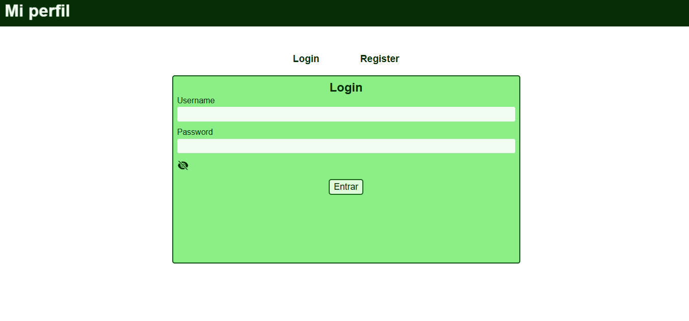
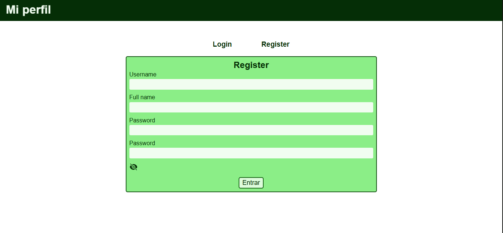
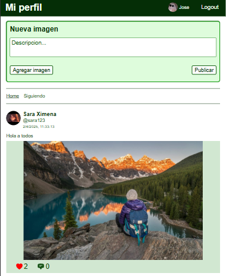
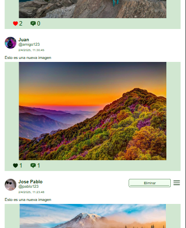
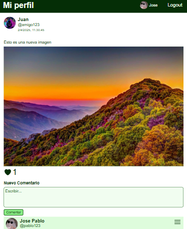
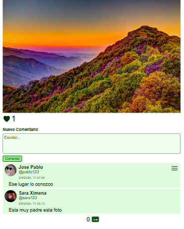
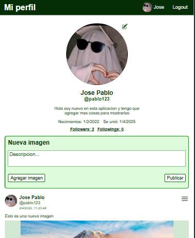
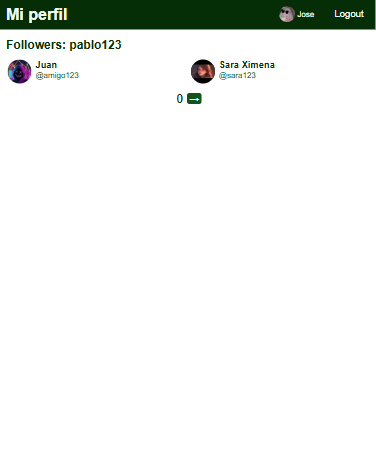

# Client Social media

These files are the frontend part.

## Technologies

- Languages: Typescript, Sass
- Tool development: [Vite](https://vite.dev/ "Vite"), NodeJS
- Libraries: React, React Router Dom, [Redux Toolkit](https://redux-toolkit.js.org/ "Redux Toolkit")

## Instalation

- Clone or download this repository

In the frontend files write the following commands:

`npm installl`

`npm run dev` - Starts the application in development mode.
`npm run build` - Generates the static files for production.

## Paths and Screenshots

The paths was established by React Router Dom

### /Login

Users can log in or register through this path.

---

### /home and /followsimage

These paths share the same design, however `/home` displays whatever images while `/followlist` displays images that user is following.

---

### /oneimage

This path displays a complete image along with comments.

---

### /perfil

This path displays perfil design.

---

### /friend

This path displays perfil design of other user.

### /followlist

This path displays two types of follows list: Followings or followers using a query `mode={followers|followings}`.

